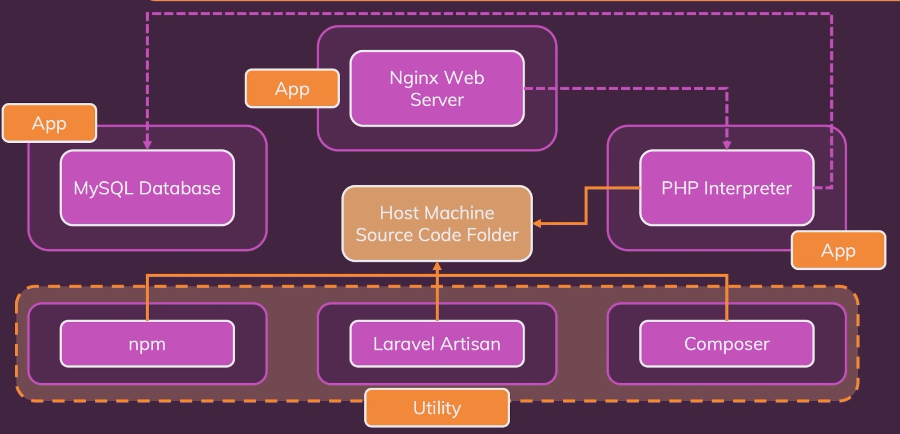

# Description

A simple PHP,Laravel and Nginx Dockerized Web Application

### Architecture

App Containers:
1. Nginx Web Server
2. PHP Interpreter
3. MySQL Database

Utility Containers:
4. Composer
5. Laravel Artisan
6. npm

### Diagram

